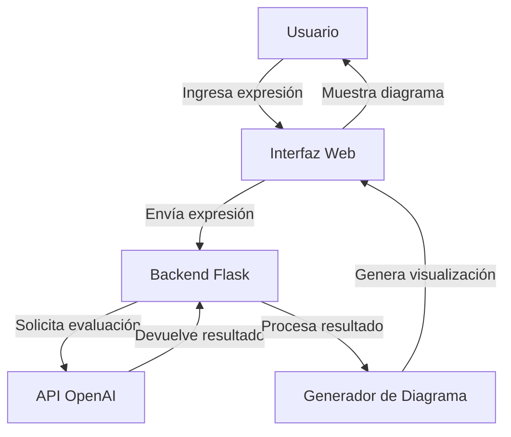

# Arquitectura de la Aplicación Web de Diagramas de Venn

## Descripción General

Esta aplicación web en Flask permitirá a los usuarios ingresar expresiones de teoría de conjuntos (como "A or B") y visualizar el resultado en un diagrama de Venn de 3 conjuntos. Los conjuntos A, B y C tienen valores fijos predefinidos, y cada región del diagrama de Venn tendrá al menos un elemento.

## Conjuntos Predefinidos

- **Conjunto A**: {1, 4, 6, 7}
- **Conjunto B**: {2, 4, 5, 7}
- **Conjunto C**: {3, 5, 6, 7}

## Arquitectura del Sistema



### Componentes Principales

1. **Interfaz de Usuario (Frontend)**
   - Formulario simple con campo de texto para ingresar expresiones
   - Botón para enviar la expresión
   - Área para mostrar el diagrama de Venn resultante
   - Área para mostrar feedback (errores o información)

2. **Backend (Flask)**
   - Rutas para manejar solicitudes
   - Lógica para procesar expresiones
   - Integración con la API de OpenAI
   - Generación del diagrama de Venn basado en los resultados

3. **Integración con OpenAI**
   - Conexión con la API de OpenAI (gpt-4.1-mini)
   - Envío de expresiones para evaluación
   - Procesamiento de respuestas

4. **Generador de Diagramas de Venn**
   - Lógica para crear diagramas de Venn basados en los conjuntos y expresiones
   - Colorear las regiones correspondientes según la expresión evaluada

## Flujo de Datos

1. El usuario ingresa una expresión (ej. "A or B") en el campo de texto y hace clic en el botón de enviar.
2. La aplicación Flask recibe la expresión y la envía a la API de OpenAI.
3. La API de OpenAI evalúa la expresión, calcula los subconjuntos relevantes y devuelve el resultado.
4. El backend procesa la respuesta y determina qué regiones del diagrama de Venn deben colorearse.
5. Se genera el diagrama de Venn con las regiones coloreadas.
6. El diagrama se muestra al usuario junto con cualquier feedback relevante.

## Estructura de Archivos

```
ProyectoVenn/
│
├── app.py                  # Aplicación principal de Flask
├── templates/              # Plantillas HTML
│   ├── index.html          # Página principal
│   └── base.html           # Plantilla base
│
├── static/                 # Archivos estáticos
│   ├── css/                # Estilos CSS
│   │   └── style.css       # Estilos principales
│   ├── js/                 # JavaScript
│   │   └── main.js         # Lógica del cliente
│   └── img/                # Imágenes
│
├── utils/                  # Utilidades
│   ├── openai_client.py    # Cliente para la API de OpenAI
│   └── venn_diagram.py     # Generador de diagramas de Venn
│
├── config.py               # Configuración de la aplicación
├── requirements.txt        # Dependencias
└── .env                    # Variables de entorno (no incluir en control de versiones)
```

## Tecnologías

- **Backend**: Flask (Python)
- **Frontend**: HTML, CSS, JavaScript
- **Visualización**: SVG para los diagramas de Venn
- **IA**: API de OpenAI (gpt-4.1-mini)
- **Despliegue**: A definir (local inicialmente)

## Consideraciones Técnicas

1. **Manejo de Expresiones**:
   - Las expresiones pueden incluir operadores como "and", "or", "not", etc.
   - Se debe validar la sintaxis de las expresiones antes de enviarlas a la API.

2. **Diagrama de Venn**:
   - El diagrama siempre mostrará 3 conjuntos (A, B, C).
   - Cada región tendrá al menos un elemento según los conjuntos predefinidos.
   - Las regiones que cumplan con la expresión se colorearán de forma distintiva.

3. **Seguridad**:
   - Las credenciales de la API de OpenAI se manejarán de forma segura mediante variables de entorno.
   - Se implementará validación de entrada para prevenir inyecciones.

4. **Rendimiento**:
   - Se considerará el caching de resultados para expresiones comunes.
   - Se optimizará la generación de diagramas para una respuesta rápida.